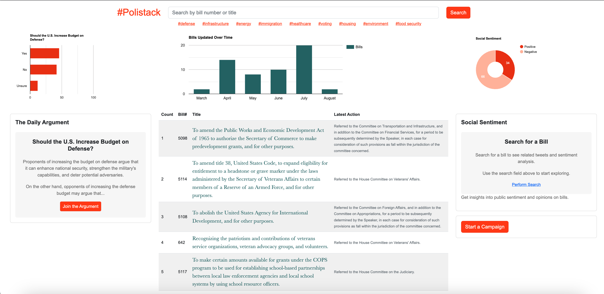

# Polistack

Polistack is a web application that aims to match a person's policy interest with current public sentiment surrounding the policy. It provides a user-friendly interface to retrieve policy information from Congress.gov and relevant public reactions from Twitter. The app utilizes MongoDB as the backend database and incorporates indexing algorithms and stemming techniques for efficient data retrieval. The goal is to empower individuals to stay informed about governmental policy updates and understand public sentiment, enabling faster and more informed action.

**Built by RIT Students:** Rishabh Arora, Christian Haacke, Odin Wright, Arjun Kozhissery

**ROLES**
+ KPIs / DOCUMENTATION = Christian
+ INTERFACE / PRODUCT = Odin
+ MODELS / ALGORITHMS = Arjun
+ INTEGRATIONS / APIs = Rishabh
+ DATABASE / DATALAKE = Rishabh
+ ACCOUNTS / MANAGEMENT = Odin

**TECH STACK**
+ MONGO
+ PYTHON / DJANGO
+ JAVASCRIPT (AJAX) / HTML / CSS

## URLs

### LocalHost
- Home Screen - Bills: `http://127.0.0.1:8000/congress/bills/`
- Specific Bill: `http://127.0.0.1:8000/congress/bill/4376/`

### Server URLS
- https://polistack.com/congress/bills/
- https://polistack.vercel.app/congress/bills/

## Versions

- Python and Django versions used: Check the [Pipfile](Pipfile) for the specific versions of Python and Django used in this project.

## Commands References

### Mac OS

Before running the commands, ensure that you have the latest version of Python installed.

* `pipenv install django` - Install django.
* `python3 --version` - Verify the installed Python version.
* `pip3 install pipenv` - Install Pipenv, a dependency management tool.
* `pipenv shell` - Activate the virtual environment for your project.
* `pipenv --venv` - Find path to virtual environment.
* `django-admin startproject name_of_your_project .` - Create a new Django project in the current directory.
* `python3 manage.py runserver` - Start the development server at http://127.0.0.1:8000/. 
* `source /path/to/virtual_environment/bin/activate` Sometimes the runserver command fails use this for alternative.
* `python3 manage.py startapp app_name` - Start a new django app
* `pip3 show django` - Check if django is installed and details are shown.
* `pip3 install requests`
* `pipenv install django-debug-toolbar`
* `pip3 install pytz`
* `python3 manage.py makemigrations polistackapp`
* `python3 manage.py migrate`
* `pip3 install pymongo`
* `pip install django-bootstrap5`
* `pipenv clean`
* `pipenv install`

#### Note: `python3` is used for avoiding using the Mac pre-installed python version.

Make sure to execute these commands in the project directory to set up and run your Django project successfully.

## Shortcuts in VS Code

### Mac OS
* `control + l` - clear terminal window.
* `command + b` - show/hide explorer panel.
* `control + \` ` -  show/hide terminal
* `command + p` - search box

## Appendix

* https://code.visualstudio.com/docs/python/tutorial-django
* https://www.youtube.com/watch?v=rHux0gMZ3Eg&ab_channel=ProgrammingwithMosh
* https://django-debug-toolbar.readthedocs.io/en/latest/
* https://code.visualstudio.com/
* https://www.mongodb.com/try/download/shell
* https://www.mongodb.com/compatibility/mongodb-and-django
* https://github.com/mongodb-developer/django-pymongo
* https://api.mongodb.com/python/2.2/faq.html?_ga=2.136644660.560181402.1687041417-351804012.1686568017&_gac=1.59901535.1686568021.CjwKCAjwhJukBhBPEiwAniIcNXKamAg1LK4X06scbwnCbUoSfPL4Qydc2LU9KugZ5PFyMAdt0mOcPxoCV2QQAvD_BwE
* https://api.congress.gov/#/bill/bill_list_all
* https://developer.mozilla.org/en-US/docs/Learn/Server-side/Django/Home_page
* https://pypi.org/project/django-bootstrap5/
* https://www.mongodb.com/developer/products/atlas/atlas-search-relevancy-explained/

## Screenshots

**Home Screen**

**Search Results Screen**

**Bill Detail**

## Demo links

* Checkpoint 2: https://youtu.be/sXovaXZjB-s 
* Final Presenation: https://youtu.be/DGt3vqvHb7k

## Slides

* https://docs.google.com/presentation/d/1WRx7KTcHE8djlydXovWh1GaXDHyi7Gw4z0tSykGmitw
* [Final Presentation](https://github.com/RITTEAM100/polistack/blob/main/presentation%20slides/%23Polistack%20-%20Final%20Presentation.pdf)
